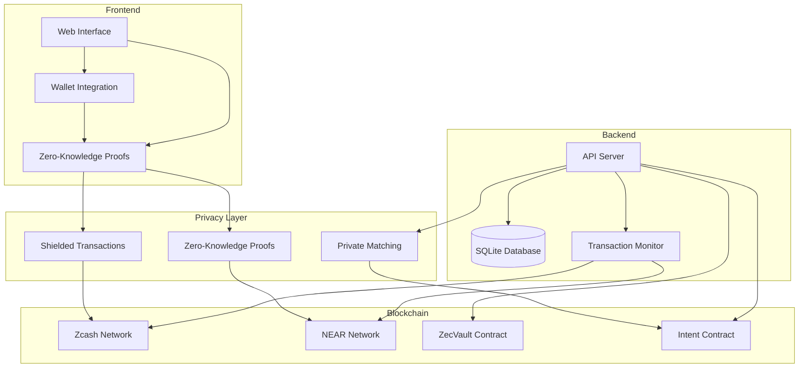

# ZSecretEscrow 🔒

<div align="center">
  
  <p><em>Privacy-Preserving Escrow Platform on Zcash & NEAR</em></p>
  <p>
    <a href="#demo">Watch Demo</a> •
    <a href="#architecture">Architecture</a> •
    <a href="#contracts">Contracts</a> •
    <a href="#getting-started">Get Started</a>
  </p>
</div>

## 🏆 Zcash x NEAR Hackathon Submission

ZSecretEscrow is a groundbreaking privacy-preserving escrow platform that leverages the power of Zcash's shielded transactions and NEAR's smart contracts to create a secure, private, and efficient escrow service. Built for the Zcash x NEAR Hackathon, this project demonstrates the potential of cross-chain privacy solutions in DeFi.

## 🌟 Key Features

- **Zero-Knowledge Escrow**: Leverages Zcash's shielded transactions for private fund management
- **Smart Contract Integration**: NEAR smart contracts for escrow logic and intent matching
- **Privacy-Preserving Identity**: Shielded addresses and private reputation system
- **Cross-Chain Compatibility**: Seamless integration between Zcash and NEAR
- **Intent Matching System**: Privacy-preserving matching of clients and freelancers
- **Shielded Payments**: Private transaction history and earnings tracking

## 🏗️ Architecture



### Core Components

1. **Frontend Layer**
   - Next.js web application
   - Wallet integration (Y Wallet, Zingo, Zashi)
   - Zero-knowledge proof generation
   - Privacy-preserving UI components

2. **Backend Services**
   - Node.js API server
   - SQLite database
   - Transaction monitoring service
   - Intent matching system

3. **Blockchain Integration**
   - Zcash shielded transactions
   - NEAR smart contracts
   - Cross-chain communication

4. **Privacy Layer**
   - Shielded transaction handling
   - Zero-knowledge proof generation
   - Private intent matching
   - Cross-chain verification

## 📜 Smart Contracts

### ZecVault Contract (Base Sepolia)
[View Contract Code](./src/contracts/ZecVault.sol)
```solidity
Address: 0xD6D0F20D055748302877a2a635a22F5dD0d0433D
```

Key Functions:
- `deposit`: Shielded deposit of ZEC
- `withdraw`: Private withdrawal with zero-knowledge proof
- `createEscrow`: Initialize new escrow agreement
- `releaseFunds`: Release funds to recipient

### Intent Contract (NEAR)
[View Contract Code](./src/contracts/intent-contract/src/lib.rs)
```rust
Account: escrow-intent.cbof.testnet
```

Key Functions:
- `createIntent`: Create new intent for matching
- `matchIntent`: Privacy-preserving intent matching
- `verifyProof`: Verify zero-knowledge proofs
- `updateStatus`: Update intent status

## 🚀 Getting Started

### Prerequisites
- Node.js v18+
- Rust toolchain
- NEAR CLI
- Zcash lightwalletd
- SQLite3

### Quick Start
```bash
# Clone and install
git clone https://github.com/yourusername/ZSecretEscrow.git
cd ZSecretEscrow
npm install

# Initialize database
npm run db:init

# Start the application
npm run start
```

### Detailed Setup

1. Clone the repository:
```bash
git clone https://github.com/yourusername/ZSecretEscrow.git
cd ZSecretEscrow
```

2. Install dependencies:
```bash
# Frontend
cd web
npm install

# Backend
cd ../src
npm install
```

3. Configure environment:
```bash
cp .env.example .env
# Update .env with your configuration
```

4. Initialize database:
```bash
# From the src directory
npm run db:init
# This will create the database and run migrations
```

5. Start the application:
```bash
# Start both frontend and backend
npm run start

# Or start them separately:
# Backend
cd src
npm run dev

# Frontend (in a new terminal)
cd web
npm run dev
```

6. Access the application:
```
http://localhost:3000
```

### Database Initialization
The application requires a SQLite database to be initialized before first use. This database stores:
- User profiles
- Escrow agreements
- Transaction history
- Intent matching data

Run the following commands to initialize the database:
```bash
cd src
npm run db:init
```

This will:
1. Create the SQLite database file
2. Run all migrations
3. Seed initial data if needed

## 🔒 Privacy Features

### Zero-Knowledge Proofs
- Shielded transaction amounts
- Private reputation scores
- Confidential escrow details
- Hidden payment history

### Shielded Addresses
- Private wallet addresses
- Untraceable transactions
- Confidential user profiles
- Hidden activity history

## 🎥 Demo

[Demo Video Link]

### Key Demo Scenarios

1. **Private Escrow Creation**
   - Create shielded escrow
   - Generate zero-knowledge proof
   - Verify on-chain

2. **Intent Matching**
   - Create private intent
   - Match with compatible parties
   - Verify matches privately

3. **Shielded Payments**
   - Receive private payments
   - Track shielded earnings
   - View private transaction history

## 📸 Screenshots

[Add screenshots of key features]

## 🔧 Technical Stack

### Frontend
- Next.js 14
- TypeScript
- Tailwind CSS
- Shadcn UI
- Zero-knowledge proof generation

### Backend
- Node.js
- Express
- SQLite
- NEAR Protocol SDK
- Zcash lightwalletd

### Blockchain
- Zcash (shielded transactions)
- NEAR Protocol (smart contracts)
- Base Sepolia (ZecVault)

## 📚 API Documentation

### Core Endpoints

```typescript
// Escrow Management
POST /api/escrow/create
POST /api/escrow/release
GET /api/escrow/:id

// Intent Matching
POST /api/intent/create
GET /api/intent/matches
POST /api/intent/accept

// Privacy Features
POST /api/privacy/shield
GET /api/privacy/proof
```

## 🔐 Security Considerations

- Zero-knowledge proofs for all sensitive operations
- Shielded transactions for fund management
- Private reputation system
- Secure key management
- Cross-chain verification

## 🤝 Contributing

1. Fork the repository
2. Create your feature branch
3. Commit your changes
4. Push to the branch
5. Create a Pull Request

## 📝 License

This project is licensed under the MIT License - see the [LICENSE](LICENSE) file for details.

## 🙏 Acknowledgments

- Zcash Foundation
- NEAR Protocol
- Base Protocol
- All contributors and supporters

---

<div align="center">
  <p>Built with ❤️ for the Zcash x NEAR Hackathon</p>
</div>