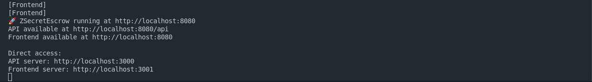

# ZSecretEscrow 🔒

<div align="center">
   
   <p><em>Privacy-Preserving Escrow Platform on Zcash & NEAR</em></p>
   <p>
      <a href="#demo">Watch Demo</a> •
      <a href="#architecture">Architecture</a> •
      <a href="#contracts">Contracts</a> •
      <a href="#getting-started">Get Started</a>
   </p>
</div>

## 🏆 Zcash x NEAR Hackathon Submission

ZSecretEscrow is a groundbreaking privacy-preserving escrow platform that leverages the power of Zcash's shielded transactions and NEAR's smart contracts to create a secure, private, and efficient escrow service. Built for the Zcash x NEAR Hackathon, this project demonstrates the potential of cross-chain privacy solutions in DeFi.

## 🌟 Key Features

- **Zero-Knowledge Escrow**: Leverages Zcash's shielded transactions for private fund management
- **Smart Contract Integration**: NEAR smart contracts for escrow logic and intent matching
- **Privacy-Preserving Identity**: Shielded addresses and private reputation system
- **Cross-Chain Compatibility**: Seamless integration between Zcash and NEAR
- **Intent Matching System**: Privacy-preserving matching of clients and freelancers
- **Shielded Payments**: Private transaction history and earnings tracking

## 🏗️ Architecture


### Core Components

1. **Frontend Layer**
    - Next.js web application
    - Wallet integration (Y Wallet, Zingo, Zashi)
    - Zero-knowledge proof generation
    - Privacy-preserving UI components

2. **Backend Services**
    - Node.js API server
    - SQLite database
    - Transaction monitoring service
    - Intent matching system

3. **Blockchain Integration**
    - Zcash shielded transactions
    - NEAR smart contracts
    - Cross-chain communication

4. **Privacy Layer**
    - Shielded transaction handling
    - Zero-knowledge proof generation
    - Private intent matching
    - Cross-chain verification

## 📜 Smart Contracts

### ZecVault Contract (Base Sepolia)
[View Contract Code](https://github.com/cbof16/ZSecretEscrow/tree/main/web/src/contracts/evm)
```solidity
Address: 0xD6D0F20D055748302877a2a635a22F5dD0d0433D
```

Key Functions:
- `deposit`: Shielded deposit of ZEC
- `withdraw`: Private withdrawal with zero-knowledge proof
- `createEscrow`: Initialize new escrow agreement
- `releaseFunds`: Release funds to recipient

### Intent Contract (NEAR)
[View Contract Code](https://github.com/cbof16/ZSecretEscrow/tree/main/web/src/contracts/near)
```rust
Account: cbof.testnet
```

Key Functions:
- `createIntent`: Create new intent for matching
- `matchIntent`: Privacy-preserving intent matching
- `verifyProof`: Verify zero-knowledge proofs
- `updateStatus`: Update intent status

## 🚀 Getting Started

### Prerequisites
- Node.js v18+
- Rust toolchain
- NEAR CLI
- Zcash lightwalletd
- SQLite3

### Quick Start
```bash
# Clone and install
git clone https://github.com/cbof16/ZSecretEscrow.git
cd ZSecretEscrow
npm install

# Initialize database
npm run db:init

# Start the application
npm run start
```

### Detailed Setup

1. Clone the repository:
```bash
git clone https://github.com/cbof16/ZSecretEscrow.git
cd ZSecretEscrow
```

2. Install dependencies:
```bash
# Frontend
cd web
npm install

# Backend
cd ../src
npm install
```

3. Configure environment:
```bash
cp .env.example .env
# Update .env with your configuration
```

4. Initialize database:
```bash
# From the src directory
npm run db:init
# This will create the database and run migrations
```

5. Start the application:
```bash
# Start both frontend and backend
npm run start

# Or start them separately:
# Backend
cd src
npm run dev

# Frontend (in a new terminal)
cd web/src/client
npm run dev
```

6. Access the application:
```
http://localhost:3000
```

### Database Initialization
The application requires a SQLite database to be initialized before first use. This database stores:
- User profiles
- Escrow agreements
- Transaction history
- Intent matching data

Run the following commands to initialize the database:
```bash
cd src
npm run db:init
```

This will:
1. Create the SQLite database file
2. Run all migrations
3. Seed initial data if needed

## 🔒 Privacy Features

### Zero-Knowledge Proofs
- Shielded transaction amounts
- Private reputation scores
- Confidential escrow details
- Hidden payment history

### Shielded Addresses
- Private wallet addresses
- Untraceable transactions
- Confidential user profiles
- Hidden activity history

## 🎥 Demo

[Demo Video Link]

### Key Demo Scenarios

1. **Private Escrow Creation**
    - Create shielded escrow
    - Generate zero-knowledge proof
    - Verify on-chain

2. **Intent Matching**
    - Create private intent
    - Match with compatible parties
    - Verify matches privately

3. **Shielded Payments**
    - Receive private payments
    - Track shielded earnings
    - View private transaction history

## 📸 Screenshots



### Running Service

## 🔧 Technical Stack

### Frontend
- Next.js 15
- TypeScript
- Tailwind CSS
- Shadcn UI
- Zero-knowledge proof generation

### Backend
- Node.js
- Express
- SQLite
- NEAR Protocol SDK
- Zcash lightwalletd

### Blockchain
- Zcash (shielded transactions)
- NEAR Protocol (smart contracts)
- Base Sepolia (ZecVault)

## 📚 API Documentation

### Core Endpoints

#### Escrow Management
```typescript
// Create a new escrow agreement
POST /api/escrow/create
Request:
{
  "amount": "1.5",
  "receiverAddress": "zs1...",
  "deadlineTimestamp": 1678954321,
  "terms": "Project delivery by specified date"
}
Response:
{
  "id": "esc-12345",
  "status": "created",
  "shieldedTxId": "txid..."
}

// Release funds from escrow
POST /api/escrow/release
Request:
{
  "escrowId": "esc-12345",
  "proof": "base64encodedproof..."
}
Response:
{
  "success": true,
  "txId": "txid..."
}

// Get escrow details
GET /api/escrow/:id
Response:
{
  "id": "esc-12345",
  "amount": "1.5",
  "status": "active",
  "createdAt": "2023-06-15T10:30:00Z",
  "deadline": "2023-07-15T10:30:00Z"
}
```

#### Intent Matching
```typescript
// Create a new intent
POST /api/intent/create
Request:
{
  "type": "service",
  "category": "development",
  "budget": "2.5",
  "description": "Smart contract development",
  "private": true
}
Response:
{
  "intentId": "int-67890",
  "status": "pending"
}

// Get matching intents
GET /api/intent/matches
Response:
{
  "matches": [
    {
      "intentId": "int-12345",
      "category": "development",
      "compatibility": 0.85,
      "shieldedDetails": true
    },
    // More matches...
  ]
}

// Accept an intent match
POST /api/intent/accept
Request:
{
  "matchId": "match-12345",
  "proof": "base64encodedproof..."
}
Response:
{
  "success": true,
  "escrowId": "esc-54321"
}
```

#### Privacy Features
```typescript
// Shield a transaction
POST /api/privacy/shield
Request:
{
  "amount": "3.0",
  "memo": "Payment for services"
}
Response:
{
  "success": true,
  "shieldedTxId": "txid..."
}

// Generate zero-knowledge proof
GET /api/privacy/proof
Request:
{
  "type": "reputation",
  "minimumScore": 4.5
}
Response:
{
  "proof": "base64encodedproof...",
  "expiresAt": "2023-07-01T00:00:00Z"
}
```

#### Balance & Transactions
```typescript
// Get user balance
GET /api/balance
Response:
{
  "balance": "5.25",
  "pendingBalance": "1.5",
  "shielded": true
}

// Get transaction history
GET /api/transactions
Response:
{
  "transactions": [
    {
      "id": "tx-12345",
      "amount": "1.5",
      "type": "deposit",
      "timestamp": "2023-06-10T08:25:00Z",
      "shielded": true
    },
    // More transactions...
  ]
}
```

#### User Profile
```typescript
// Get user profile
GET /api/user/profile
Response:
{
  "username": "user123",
  "reputation": 4.8,
  "completedEscrows": 12,
  "shieldedIdentity": true
}

// Update user profile
PATCH /api/user/profile
Request:
{
  "displayName": "New Name",
  "contactInfo": "encrypted-contact-data"
}
Response:
{
  "success": true,
  "updated": ["displayName", "contactInfo"]
}
```

## 🔐 Security Considerations

- Zero-knowledge proofs for all sensitive operations
- Shielded transactions for fund management
- Private reputation system
- Secure key management
- Cross-chain verification

## 🤝 Contributing

1. Fork the repository
2. Create your feature branch
3. Commit your changes
4. Push to the branch
5. Create a Pull Request

## 📝 License

This project is licensed under the MIT License - see the [LICENSE](LICENSE) file for details.

## 🙏 Acknowledgments

- Zcash Foundation
- NEAR Protocol
- Base Protocol
- All contributors and supporters

---

<div align="center">
   <p>Built with ❤️ for the Zcash x NEAR Hackathon</p>
</div>
